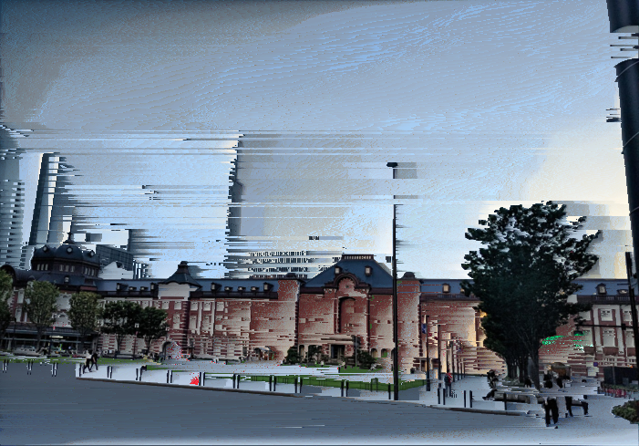

# asdf-pixel-sort

[](https://crates.io/crates/asdf-pixel-sort)
[](https://docs.rs/asdf-pixel-sort)
[](https://github.com/kuy/asdf-pixel-sort/actions/workflows/ci.yml)

Rust implementation of pixel sorting algorithm "ASDF" by [Kim Asendorf](http://kimasendorf.com/).



## Usage

```toml
asdf-pixel-sort = "0.0.7"
```

## Example

```rust
use asdf_pixel_sort::sort;

fn main() {
    let img = image::open("pic.jpg").unwrap();
    let mut buf = img.to_rgb8();

    sort(&mut buf);

    buf.save("sorted.jpg").unwrap();
}
```

You may also need [`image`](https://crates.io/crates/image) crate to run above code.

Use `sort_with_options()` function to configure with options.

```rust
let color = PColor::new(0, 62, 214);
let options = Options {
    mode: Mode::Black(color),
};
sort_with_options(&mut buf, &options);
```

## Documentation

See [documentation](https://docs.rs/asdf-pixel-sort) on docs.rs.

## Changelogs

See [releases](https://github.com/kuy/asdf-pixel-sort/releases) page on GitHub.

## License

MIT

## Author

Yuki Kodama / [@kuy](https://twitter.com/kuy)
